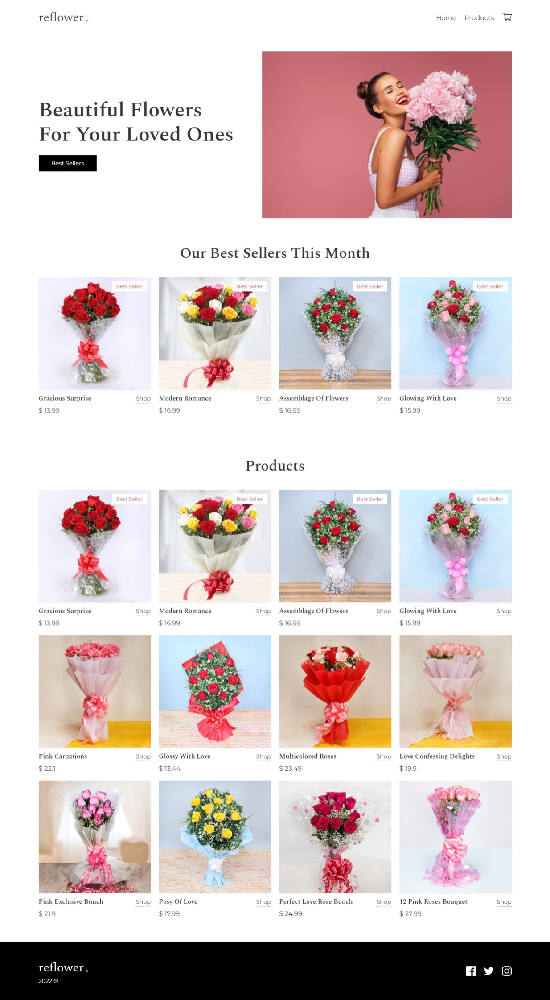
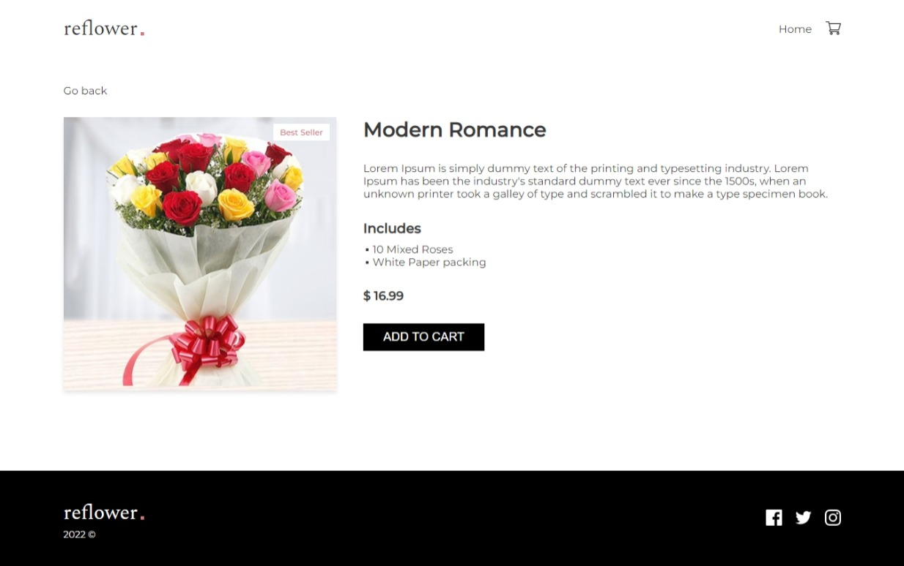
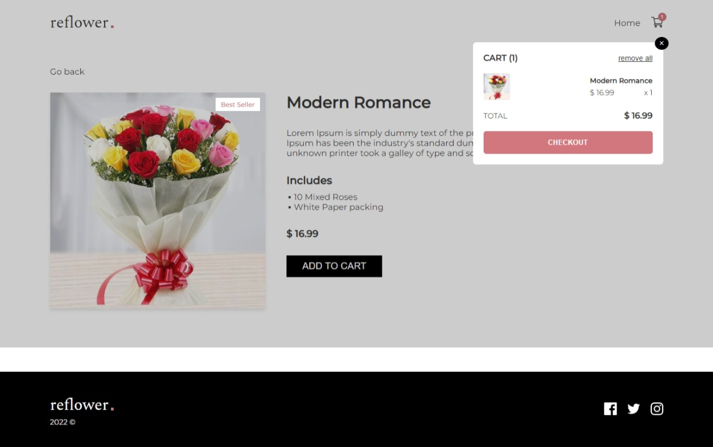
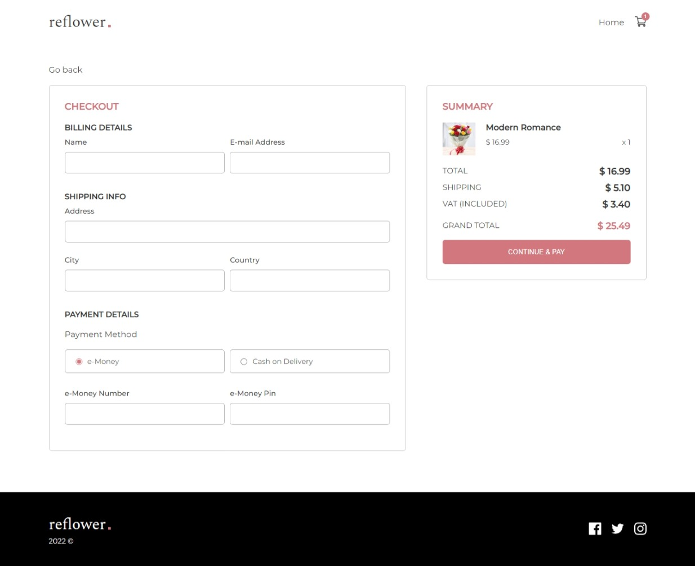

## Flower Store

- O projeto consiste em uma floricultura on-line, na qual seus usuários podem escolher dentre as opções disponíveis e efetuar a compra, podendo pagar virtualmente por meio de uma ficítia moeda eletrônica ou no momento da entrega.

## Sumário

- [Tecnologias utilizadas](#tecnologias)
- [Instruções para rodar o projeto](#instrucoes)
- [Organização e estruturação do projeto](#organizacao)
- [Desenvolvimento](#desenvolvimento)
- [Imagens](#imagens)

## Tecnologias Utilizadas <a name="tecnologias"></a>

- [**React**](https://pt-br.reactjs.org/)
- [**React Hooks**](https://pt-br.reactjs.org/docs/hooks-intro.html)
- [**Styled Components**](https://styled-components.com/)
- [**Redux Toolkit**](https://redux-toolkit.js.org/)
- [**React Redux**](https://react-redux.js.org/)
- [**React Router Dom**](https://v5.reactrouter.com/web/guides/quick-start)
- [**React Hook Form**](https://react-hook-form.com/)


## Instruções para rodar o projeto <a name="instrucoes"></a>

### Será necessário ter instalado na sua máquina:

```
Git
React
Vite
```

- Clone o repositório com o comando **git clone**:

```
git clone https://github.com/felipehimself/flower-store
```

- Entre no diretório que acabou de ser criado:

```
cd flower-store
```

- Para o projeto funcionar na sua máquina, será necessário instalar suas dependências, para isso, utilize o comando:

```
npm install
```

- Pronto, agora o projeto está pronto para ser rodado localmente, utilizando o comando **npm run dev**:

```
npm run dev
```

## Organização e estruturação do projeto <a name="organizacao"></a>

O projeto está organizado e estruturado da seguinte forma:

```
─src
    │   App.tsx
    │   favicon.svg
    │   main.tsx
    │   vite-env.d.ts
    │
    ├───assets
    │       flower-1.jpeg
    │       flower-10.jpeg
    │       flower-11.jpeg
    │       flower-12.jpeg
    │       flower-2.jpeg
    │       flower-3.jpeg
    │       flower-4.jpeg
    │       flower-5.jpeg
    │       flower-6.jpeg
    │       flower-7.jpeg
    │       flower-8.jpeg
    │       flower-9.jpeg
    │       hero-img.jpg
    │       img-2.jpg
    │       img-3.jpeg
    │       img-4.jpg
    │
    ├───components
    │   ├───Badge
    │   │       Badge.tsx
    │   │       style.ts
    │   │
    │   ├───CartModal
    │   │       CartModal.tsx
    │   │       style.ts
    │   │
    │   ├───CheckoutModal
    │   │       CheckoutModal.tsx
    │   │       style.ts
    │   │
    │   ├───Footer
    │   │       Footer.tsx
    │   │       styles.ts
    │   │
    │   ├───GoBack
    │   │       GoBack.tsx
    │   │       styles.ts
    │   │
    │   ├───Navbar
    │   │       Navbar.tsx
    │   │       styles.ts
    │   │
    │   ├───ProductCard
    │   │       ProductCard.tsx
    │   │       styles.ts
    │   │
    │   ├───ScrollToTop
    │   │       ScrollToTop.tsx
    │   │
    │   ├───shared
    │   │       shared.ts
    │   │
    │   └───SVGs
    │           CartIcon.tsx
    │           CheckIcon.tsx
    │           FbIcon.tsx
    │           InstaIcon.tsx
    │           PaymentIcon.tsx
    │           StarIcon.tsx
    │           TwitterIcon.tsx
    │
    ├───constants
    │       styles.ts
    │
    ├───global
    │       GlobalStyles.ts
    │
    ├───interfaces
    │       DataInterface.ts
    │
    ├───pages
    │   ├───Checkout
    │   │       Checkout.tsx
    │   │       styles.ts
    │   │
    │   ├───Home
    │   │       Home.tsx
    │   │       styles.ts
    │   │
    │   └───Product
    │           Product.tsx
    │           styles.ts
    │
    ├───slices
    │       cartSlice.ts
    │       dataSlice.ts
    │       modalCartSlice.ts
    │       modalCheckoutSlice.ts
    │
    ├───store
    │       store.ts
    │
    └───utils
            data.ts
            functions.ts
```

## Desenvolvimento <a name="desenvolvimento" ></a>

### Estilização

Para realizar a estilização, foi utilizado:

- [**Styled Components**](https://styled-components.com/).

### Esquema de rotas

Para a implementação de rotas foi utilizado:

- [**React Router Dom**](https://v5.reactrouter.com/web/guides/quick-start)

### Gerenciamento de Estados

Para o gerenciamento de estados foram utilizados:

- [**Redux Toolkit**](https://redux-toolkit.js.org/)
- [**React Redux**](https://react-redux.js.org/)

### Controle do Formulário

Para gerenciar as informações do formulário foi utilizado:

- [**React Hook Form**](https://react-hook-form.com/)


## Imagens <a name="imagens" ></a>

### Desktop

 
 
 
 
 


### Mobile

 
 
 
 

